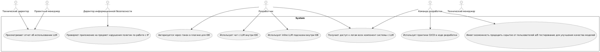

# Лабораторная работа №1
```
Тема: Формулирование требований к программной системе
Цель работы: Научиться анализировать поставленную задачу, формулировать функциональные и нефункциональные требования к проектируемой системе.
Ожидаемые результаты:
1. Перечень заинтересованных лиц (стейкхолдеров) с краткими описаниями (2 балла)
2. Перечень функциональных требований (2 балла)
3. Диаграмма вариантов использования для функциональных требований (2 балла)
4. Перечень сделанных предположений (всё, что не оговорено в постановке явно можно “додумать” самостоятельно) (2 балла)

Повышенная сложность:
5. Перечень нефункциональных требований (2 балла)
```

# Формулирование требований к программной системе

## 1. Стейкхолдеры

- Технический директор - заинтересован в увеличении скорости разработки ПО, хочет видеть дашборд с отчетом об использовании 
- Директор иформационной безопасности - заинтересован в обеспечении сохранности коммерческой тайны
- Проектный менеджер - заинтересован в достижении целей проекта в установленные сроки, итеративном улучшении продукта
- Технический менеджер - заинтересован в качественной имплементации требований проекта
- Разработчики - планирует использовать ИИ ассистента на всем жизненном цикле ПО для снижения когнитивной нагрузки и увеличения продуктивности
  - Разработка нового функционала
  - Тестирование
  - Поддержка и рефакторинг кодовой базы
- Команда разработк проекта

## 2. Функциональные требования

Система должна предоставлять следующие функции:
- Интеграция с IDE:
   - Обеспечить совместимость с популярными средами разработки (VS Code, JetBrains).
   - Автоматическое подключение к проектам для анализа кода и данных.
- Интерфейс взаимодействия с моделью:
  - Включить чат для общения с моделью и получения помощи в реальном времени.
  - Встроить функцию автозавершения и предложения кода в редакторе для поддержки разработки.
- Логирование запросов и ответов:
  - Логировать все обращения к модели и полученные ответы.
  - Сохранять историю взаимодействий для последующего анализа и улучшения системы.
- Авторизация и аутентификация пользователей:
  - Предоставить возможность входа с использованием токенов GitLab.
  - Ограничить доступ к системе в зависимости от роли пользователя (например, только для сотрудников компании).
- Безопасное хранение данных и модели:
  - Защищать модель и пользовательские данные от несанкционированного доступа.
  - Обеспечить резервное копирование и восстановление данных. 
- Контекстуальная помощь:
  - Модель должна распознавать контекст проекта и корректно интерпретировать запросы пользователей

## 3. Диаграмма вариантов использования для функциональных требований

##### use-case diagram

```plantuml
@startuml
actor "Технический директор" as TD
actor "Проектный менеджер" as PM
actor "Директор информационной безопасности" as DIS
actor "Технический менеджер" as TM
actor "Разработчик" as Dev
actor "Команда разработки" as team

rectangle System {
    usecase "Использует чат с LLM внутри IDE" as UC1
    usecase "Использует inline LLM подсказки внутри IDE" as UC2
    usecase "Авторизуется через токен в плагине для IDE" as UC3
    usecase "Просматривает отчет об использовании LLM" as UC4
    usecase "Проверяет приложение на предмет нарушения политик по работе с IP" as UC5
    
    usecase "Получает доступ к логам всех компонент системы с LLM" as UC6
    usecase "Использует практики CI/CD в ходе разработки" as UC7
    usecase "Имеет возможность прододить скрытое от пользователей а/б тестирование для улучшения качества моделей" as UC8
    
}

TD --> UC4
DIS --> UC5
PM --> UC4
Dev --> UC1
Dev --> UC2
Dev --> UC3
Dev --> UC6
team --> UC6
team --> UC7 
team --> UC8
@enduml
```





## 4. Подробнее

- Обязательные составляющие системы: Большая языковая модель (LLM), среда разработки (IDE - VScode+Jetbrains)
- Система используется только внутри компании и доступ к ней имеют только уполномоченные сотрудники (разработчики)
- Задержка в выдаче предложений кода не должна превышать 1-2 секунд.
- Все данные о пользователях и их запросах к модели должны быть конфиденциальными и обрабатываться в рамках корпоративных правил.

## 5. Нефункциональные требования
Система должна:
1.	соответствовать требованиям информационной безопасности и защищать интеллектуальную собственность компании.
2.	иметь минимальное количество сбоев и обеспечивать бесперебойную работу в течение рабочего времени.
3.	в случае сбоя быть обеспечена возможность быстрого восстановления системы.
4.	быть простой в обслуживании, обладать возможностью быстрой установки обновлений и исправлений.
5.	обладать быстрой генерацией предложений кода и высокой отзывчивостью при взаимодействии с моделью.
