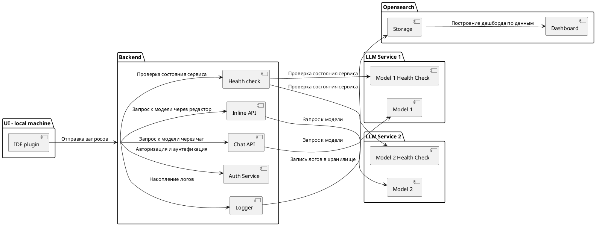

# Лабораторная работа №2
```
Тема: Использование нотации C4 model для проектирования архитектуры программной системы  
Цель работы: Получить опыт использования графической нотации для фиксации архитектурных решений

## Ожидаемые результаты
1. Диаграмма системного контекста (3 балла)
2. Диаграмма контейнеров с пояснениями по выбору базового архитектурного стиля / архитектуры уровня приложений (при этом выбрать топологию, подразумевающую несколько модулей развертывания и наличие сетевого взаимодействия) (5 баллов)

Повышенная сложность:
- Диаграмма компонентов (2 балла)
```
---

# Использование нотации C4 model для проектирования архитектуры программной системы

## 1. Диаграмма системного контекста
*Диаграмма системного контекста* определяет систему интеграции LLM в IDE, взаимодействия с внешними пользователями и сервисами. 
Основные участники — разработчики, использующие IDE с интегрированным помощником на базе LLM, и внешние системы аутентификации.

Система помогает разработчикам, предоставляя интеллектуальные подсказки и анализ кода с помощью LLM. 

Пользователи входят в IDE, а аутентификация проходит через токен, полученный после регистрации. Также есть взаимодействие с внешним сервисом для обучения и обновления LLM.

*Диаграмма:*

```plantuml
@startuml
!include https://raw.githubusercontent.com/plantuml-stdlib/C4-PlantUML/master/C4_Container.puml
left to right direction
skinparam actorStyle awesome

title System Context diagram

System(llmSystem, "LLM-based Code Assistant in IDE") {
'    Container(backend, "Backend Server", "Node.js/Express", "Handles requests from IDE")
    'Container(llmService, "LLM Service", "Python", "Processes requests and generates responses")
''    ContainerDb(database, "Logs Database", "PostgreSQL", "Stores requests and responses")
''   Container(authService, "Authentication Service", "External API", "Checks credentials")
}
System_Ext(idePlugin, "IDE Plugin", "React", "Interface for LLM interaction")
System_Ext(auth, "Auth service")
System_Ext(gitlab, "GitLab", "VCS")

Person(SH1, "Technical Director")
Person(SH2, "Director of CyberSec")
Person(SH3, "Project Manager")
Person(SH4, "Technical Manager")
Person(SH5, "Developer")
Person(SH6, "Product Development Team")
Person(SH7, "Technical Support")
Person(SH8, "Financial Director")


' Relationships
SH1 --> llmSystem : "Requests performance reports"
SH2 --> llmSystem : "Ensures data security and logs interactions"
SH3 --> llmSystem : "Monitors project progress"
SH4 --> llmSystem : "Configures and integrates the system"
SH5 --> idePlugin : "Uses the system for code suggestions"
SH6 --> gitlab : "Monitors CI/CD pipelines"
SH7 --> llmSystem : "Monitors system health and accesses documentation"
SH8 --> llmSystem : "Requests cost reports"

idePlugin --> llmSystem : "Sends LLM responses"
llmSystem --> auth : "Authenticates users"
llmSystem <-- gitlab : "Sends deployment data"
@enduml
```
## 2. Диаграмма контейнеров

Диаграмма контейнеров детализирует компоненты системы, показывая ключевые контейнеры (модули) и их взаимодействие друг с другом. В данной архитектуре предполагается многозвенная (multi-tier) структура с выделенными контейнерами для пользовательского интерфейса, серверной логики и базы данных.

Пояснения по выбору архитектурного стиля:
- Многозвенная архитектура: используется для разделения ответственности между интерфейсом пользователя (frontend), логикой бизнес-процессов (backend) и базой данных.
- Сетевое взаимодействие: контейнеры общаются через REST API, что позволяет масштабировать и заменять отдельные модули.
- Развертывание: каждый контейнер развертывается независимо, что упрощает обновления и поддержку системы.

**Диаграмма:**

```plantuml
@startuml
left to right direction
Container_Boundary(system, "Интеграция LLM в IDE") {
    Container(idePlugin, "Плагин IDE", "React", "Интерфейс взаимодействия с LLM")
    Container(backend, "Серверная часть", "Node.js/Express", "Обработка запросов от IDE")
    Container(llmService, "Сервис LLM", "Python/TensorFlow", "Обработка запросов и генерация ответов")
    ContainerDb(database, "База данных логов", "PostgreSQL", "Хранение запросов и ответов")
    Container(authService, "Сервис аутентификации", "External API", "Проверка учетных данных")
}

developer -> idePlugin : Использует IDE с плагином
idePlugin -> backend : Отправка запросов на генерацию
backend -> llmService : Отправка запросов к LLM
backend -> database : Сохранение логов
backend -> authService : Проверка учетных данных
@enduml
```

## 3. Диаграмма компонентов

Диаграмма компонентов иллюстрирует внутреннюю структуру контейнеров.

Компоненты API сервера:
- Logger — компонент для записи логов запросов и ответов.
- AuthService — компонент для проверки прав доступа и аутентификации.
- NotificationService — отвечает за отправку уведомлений пользователям.
- DataRepository — управляет операциями чтения и записи данных в базу данных.

Диаграмма:

