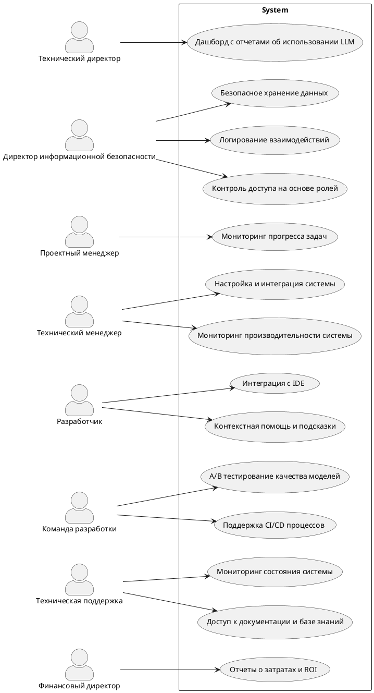

# Формулирование требований к программной системе
```
Тема: Формулирование требований к программной системе
Цель работы: Научиться анализировать поставленную задачу, формулировать функциональные и нефункциональные требования к проектируемой системе.
Ожидаемые результаты:
1. Перечень заинтересованных лиц (стейкхолдеров) с краткими описаниями (2 балла)
2. Перечень функциональных требований (2 балла)
3. Диаграмма вариантов использования для функциональных требований (2 балла)
4. Перечень сделанных предположений (всё, что не оговорено в постановке явно можно “додумать” самостоятельно) (2 балла)

Повышенная сложность:
5. Перечень нефункциональных требований (2 балла)
```

## Бизнес цель

Создание интегрированной системы с использованием ИИ-ассистента для повышения продуктивности и качества разработки ПО. 
Цель включает:
1.	Увеличение эффективности разработки: автоматизация рутинных задач, снижение когнитивной нагрузки на разработчиков.
2.	Оптимизация процессов: ускорение внедрения изменений, автоматизированное написание документации. Система должна сокращать затраты, ускорять вывод продуктов на рынок.
3.  Повышение качества: улучшение архитектуры, обнаружение ошибок на ранних этапах, обучение новых сотрудников.

## Стейкхолдеры

SH-1: Технический директор (производительность, отчетность)
- Требует повышения скорости разработки и детальных отчетов об эффективности системы.

SH-2: Директор информационной безопасности (безопасность)
- Обеспечивает защиту данных и соблюдение стандартов безопасности.

SH-3: Проектный менеджер (управляемость)
- Контролирует сроки, качество проекта и прозрачность процессов.

SH-4: Технический менеджер (реализация, поддержка)
- Отвечает за техническую реализацию требований и поддерживаемость системы.

SH-5: Разработчики (производительность, удобство)
- Используют систему для автоматизации задач, снижения нагрузки и интеграции в IDE.
- Ожидают стабильной работы и удобного интерфейса.

SH-6: Команда разработки продукта (надежность)
- Проверяет систему на корректность, производительность и соответствие требованиям.
- Обеспечивает CI/CD процессы, стабильность и масштабируемость системы.

SH-7: Техническая поддержка (доступность)
- Устраняет инциденты и помогает пользователям, требуя простоты мониторинга системы.

SH-8: Финансовый директор (экономия)
- Заинтересован в снижении затрат и прозрачности расходов.

## Функциональные требования

FR-1: Для технического директора (SH-1)
- Система должна предоставлять дашборд с отчетами об использовании LLM.

FR-2: Для директора информационной безопасности (SH-2)
- Система должна обеспечивать безопасное хранение данных, соответствующее корпоративным стандартам.
- Все взаимодействия с системой должны логироваться для проведения аудита.
- Реализовать строгую систему контроля доступа, включая роль пользователей и их привилегии.

FR-3: Для проектного менеджера (SH-3)
- Система должна поддерживать мониторинг прогресса по задачам с инструментов управления проектами.

FR-4: Для технического менеджера (SH-4)
- Система должна предоставлять инструменты настройки и интеграции для удобной реализации новых требований.
- Поддержка мониторинга производительности системы и возможности быстрого устранения сбоев.

FR-5: Для разработчиков (SH-5)
- Система должна обеспечивать интеграцию с IDE (VS Code, JetBrains) для автоматизации задач: автозавершения, анализа кода и генерации подсказок.
- Реализовать контекстную помощь для понимания запросов и текущего состояния проекта.
- Обеспечить быстрый отклик модели (менее 2 секунд) и надежность в обработке запросов.

FR-6: Для команды разработки продукта (SH-6)
- Система должна поддерживать CI/CD процессы, обеспечивая автоматическое тестирование и развертывание компонентов.
- Обеспечить возможность скрытого A/B тестирования для улучшения качества моделей.
- Реализовать инструменты мониторинга стабильности и масштабируемости системы.

FR-7: Для технической поддержки (SH-7)
- Предоставить возможность мониторинга состояния системы с оповещением о сбоях или неисправностях.
- Обеспечить доступ к документации для оперативного устранения инцидентов.

FR-8: Для финансового директора (SH-8)
- Система должна предоставлять отчеты о затратах, связанных с внедрением и эксплуатацией.


## Диаграмма вариантов использования для функциональных требований (use-case diagram)




## Ограничения

- Обязательные составляющие системы: Большая языковая модель (LLM), среда разработки (IDE - VScode+Jetbrains)
- Система используется только внутри компании и доступ к ней имеют только уполномоченные сотрудники (разработчики)
- Задержка в выдаче предложений кода не должна превышать 1-2 секунд.
- Все данные о пользователях и их запросах к модели должны быть конфиденциальными и обрабатываться в рамках корпоративных правил.

## Нефункциональные требования

QA-1: Масштабируемость (FR-5, FR-6)

- Необходимо обслуживать 400 пользователей, при этом количество запросов от каждого пользователя не должно превышать 3 в секунду.
- Система должна поддерживать высокую нагрузку, гарантируя быструю обработку запросов при росте числа пользователей.

QA-2: Доступность (FR-2, FR-3, FR-7)

- Все сервисы должны быть доступны 99.9% времени.
- Отключения системы или простои должны минимизироваться, так как они могут негативно сказаться на бизнесе и пользовательском опыте.

QA-3: Производительность (FR-5, FR-6)

- Время отклика на запросы не должно превышать 2 секунд для всех операций.
- Генерация отчетов о производительности или использовании системы не должна занимать значительное время.

QA-4: Надежность (FR-7)

- Система должна обеспечивать корректную работу при высоких нагрузках и сбоях, минимизируя вероятность потери данных.

QA-5: Безопасность (FR-2, FR-5)

+- Личные данные клиентов должны обрабатываться в соответствии с требованиями безопасности.
- Все данные о пользователях и их запросах должны быть защищены от несанкционированного доступа и утечек.

QA-6: Расширяемость (FR-4, FR-6)

- Система должна поддерживать улучшение и модификацию функционала без значительных изменений в основном коде.
- Необходимо обеспечить высокую степень модульности системы для простоты внесения изменений, интеграции новых функций и улучшений без риска нарушения стабильности.

