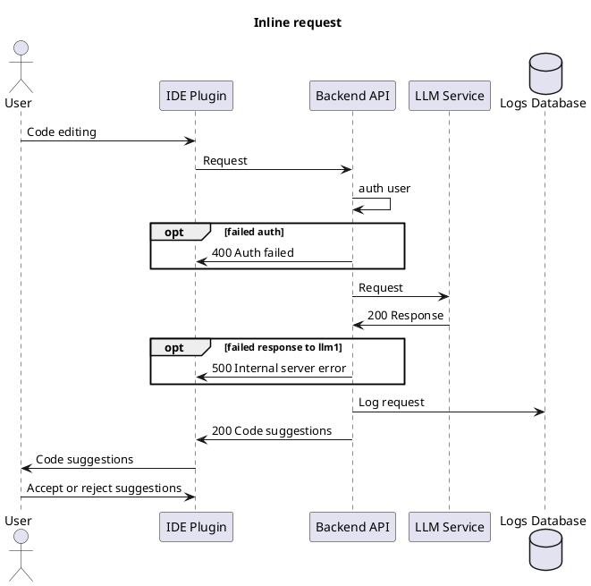
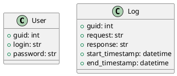

# Лабораторная работа №3

## Задание
```
Тема: Использование принципов проектирования на уровне методов и классов
Цель работы: Получить опыт проектирования и реализации модулей с использованием принципов KISS, YAGNI, DRY, SOLID и др.

Ожидаемые результаты:
Для выбранного варианта использования:
Добавить ранее созданные или создать диаграммы контейнеров и компонентов нотации C4 model.
(1 балл)
Построить диаграмму последовательностей для выбранного варианта использования (показать взаимодействие C4-компонентов для реализации выбранного варианта использования).
(2 балла)
Построить модель БД в виде диаграммы классов UML. Если по заданию не предусмотрена БД, то самостоятельно продумать возможное хранилище данных, связанное с заданием. Минимально количество сущностей: 5.
(1 балл)
Реализовать требуемый клиентский и серверный код с учетом принципов KISS, YAGNI, DRY и SOLID. Пояснить, каким образом были учтены эти принципы.
(4  балла)

Повышенная сложность: Самостоятельно ознакомиться, кратко изложить и обосновать применимость или отказ по каждому принципу разработки в отдельности
(2 балла).
Рассмотреть следующие принципы разработки:
BDUF. Big design up front («Масштабное проектирование прежде всего»)
SoC. Separation оf concerns (принцип разделения ответственности)
MVP. Minimum viable pro duct (минимально жизнеспособный продукт)
PoC. Proof of concept (доказательство концепции)
```

## Отчет по лабораторной работе №3

##### Тема: Использование принципов проектирования на уровне методов и классов
##### Цель работы: Получить опыт проектирования и реализации модулей с использованием принципов KISS, YAGNI, DRY, SOLID и др.


### Диаграмма контейнеров

Диаграмма контейнеров детализирует компоненты системы, показывая ключевые контейнеры (модули) и их взаимодействие друг с другом. 
В данной архитектуре предполагается многозвенная (multi-tier) структура с выделенными контейнерами для пользовательского интерфейса, серверной логики и базы данных.

Пояснения по выбору архитектурного стиля:

1. Микросервисная архитектура - для взаимозаменяемости компонентов, бастрого проведения жкспериментов по улучшению взаимодействия с пользователем.
2. Сетевое взаимодействие: контейнеры общаются через REST API, что позволяет масштабировать и заменять отдельные модули.
3. Развертывание: каждый контейнер развертывается независимо, что упрощает обновления и поддержку системы.

##### Диаграмма:

```plantuml
@startuml
!include https://raw.githubusercontent.com/plantuml-stdlib/C4-PlantUML/master/C4_Container.puml

title Container diagram

Person(cto, "Technical Director")
Person(cyber, "Director of CyberSec")
Person(pm, "Project Manager")
Person(tech, "Technical Manager")
Person(dev, "Developer")
Person(devteam, "Product Development Team")
Person(support, "Technical Support")
Person(fin, "Financial Director")

System_Ext(idePlugin, "IDE Plugin", "React+Kotlin", "Interface for LLM interaction")
System_Ext(gitlab, "GitLab", "VCS + Auth")

Container_Boundary(llmSystem, "LLM-based Code Assistant in IDE") {
    Container_Boundary(back, "api") {
        Container(backend, "Backend API", "Python(FastAPI)", "Handles requests from IDE plugin")
        ContainerDb(database, "Logs Database", "PostgreSQL", "Stores requests and responses")
    }
    Container(llmService1, "LLM Service1", "Python(Vllm)", "Processes requests and generates responses")
    Container(llmService2, "LLM Service2", "Python(Vllm)", "Processes requests and generates responses")
}

devteam --> gitlab : "Monitors CI/CD pipelines"
cto --> llmSystem : "Requests performance reports"
cyber --> llmSystem : "Ensures data security and logs interactions"
pm --> llmSystem : "Monitors project progress"
tech --> llmSystem : "Configures and integrates the system"
dev --> idePlugin : "Uses the system for code suggestions"

devteam --> llmSystem : "Monitors system health and accesses documentation"
fin --> llmSystem : "Requests cost reports"

idePlugin --> backend : "Sends LLM responses"
backend --> gitlab : "Authenticates users"
backend <--> llmService1 : "Code generation request"
backend <--> llmService2 : "Code generation request"
backend --> database: "Log usage data"

support --> llmSystem: "llmSystem"
backend --> llmService1 : "healtcheck"
backend --> llmService2 : "healtcheck"
backend --> database: "healtcheck"


llmSystem <-- gitlab : "Sends deployment data"
@enduml
```

### Диаграмма компонентов

Диаграмма компонентов иллюстрирует внутреннюю структуру контейнеров.

##### Компоненты API сервера:

1. Logger — компонент для записи логов запросов и ответов.
2. AuthService — компонент для проверки прав доступа и аутентификации.
3. NotificationService — отвечает за отправку уведомлений пользователям.
4. DataRepository — управляет операциями чтения и записи данных в базу данных.

##### Диаграмма:

```plantuml
@startuml
!include https://raw.githubusercontent.com/plantuml-stdlib/C4-PlantUML/master/C4_Container.puml
left to right direction

package "LLM Service 1 - Docker" {
    [API 1] --> [Model 1]
    [API 1] --> [Monitoring 1]
}

package "LLM Service 2 - Docker" {
    [API 2] --> [Model 2]
    [API 2] --> [Monitoring 2]
}


package "Backend- K8s" {
    [Backend API] --> [Logger] : Накопление логов

    [Backend API] --> [Auth Service] : Авторизация и аунтефикация
    [Backend API] --> [Chat API] : Запрос к модели через чат
    [Chat API] --> [API 1]
    [Backend API] --> [Inline API] : Запрос к модели через редактор
    [Inline API] --> [API 2]

    [Backend API] --> [Health check] : Проверка состояния сервиса
    [Backend API] --> [Monitoring 1] : Проверка состояния сервиса
    [Backend API] --> [Monitoring 2] : Проверка состояния сервиса
}

package "IDE - local machine" {
    [IDE plugin] --> [Backend API] : Отправка запросов
}

@enduml
```

### Диаграмма последовательностей

Диаграмма последовательностей показывает взаимодействие компонентов системы в рамках одного сценария использования.

##### Диаграмма:
Взаимодействие с LLM сервисами 1 и 2 через API происходит одинаково, поэтому показано только взаимодействие с LLM сервисом 1.


### Модель БД

Данные, которые будут храниться в бд:
- авторизация пользователей

Данные, что будут храниться в логгере:
- логи запросов и ответов



### Применение основных принципов разработки
TODO: <Продемонстрировать фрагменты кода, пояснив какой принцип реализуется>

### Дополнительные принципы разработки
TODO: <По каждому принципу разработки из раздела повышенной сложности обосновать отказ или применение>
