# Лабораторная работа №6
```
Тема: Использование шаблонов проектирования
Цель работы: Получить опыт применения шаблонов проектирования при написании кода программной системы.

Ожидаемые результаты:
Применить типовые шаблоны проектирования GoF (Gang of Four) для своего проекта. Продемонстрировать результаты в виде конечного кода и UML-диаграмм.
Порождающие шаблоны - 3 шт.
Структурные шаблоны - 4 шт.
Поведенческие шаблоны - 5 шт.
(8 баллов)
Возможна замена одного шаблона из другой группы шаблонов.

Повышенная сложность:
Проанализировать созданный код на наличие реализованных шаблонов GRASP. По необходимости реализовать:
5 ролей (обязанностей) классов
3 принципа разработки
1 свойство программы
(2 балла)
```
# Отчет по лабораторной работе №6

##### Тема: Использование шаблонов проектирования
##### Цель работы: Получить опыт применения шаблонов проектирования при написании кода программной системы.

## Шаблоны проектирования GoF

### Порождающие шаблоны

#### 1. Singleton (Одиночка)
**Назначение**: Гарантирует, что у класса есть только один экземпляр и предоставляет глобальную точку доступа к нему.

**Реализация**: Класс Application в app.py использует паттерн Singleton для обеспечения единственного экземпляра FastAPI приложения.

**UML-диаграмма**:
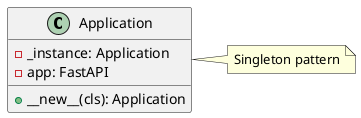

**Код**:
```python
class Application:
    _instance = None

    def __new__(cls):
        if cls._instance is None:
            cls._instance = super(Application, cls).__new__(cls)
            app = FastAPI()
            # ... initialization code ...
            cls._instance.app = app
        return cls._instance
```

#### 2. Factory Method (Фабричный метод)
**Назначение**: Определяет интерфейс для создания объекта, но позволяет подклассам решать, какой класс создавать.

**Реализация**: Класс TokenFactory в services/auth.py использует паттерн Factory Method для создания различных типов токенов.

**UML-диаграмма**:
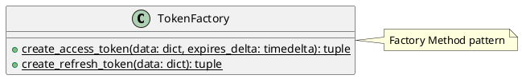

**Код**:
```python
class TokenFactory:
    @staticmethod
    def create_access_token(data: dict, expires_delta: Optional[timedelta] = None):
        """Factory method to create JWT access tokens"""
        to_encode = data.copy()
        if expires_delta:
            expire = datetime.now(timezone.utc) + expires_delta
        else:
            expire = datetime.now(timezone.utc) + timedelta(minutes=ACCESS_TOKEN_EXPIRE_MINUTES)
        to_encode.update({"exp": expire})
        encoded_jwt = jwt.encode(to_encode, SECRET_KEY, algorithm=ALGORITHM)
        return encoded_jwt, expire

    @staticmethod
    def create_refresh_token(data: dict):
        """Create a refresh token with a longer expiration time"""
        to_encode = data.copy()
        refresh_expires = datetime.now(timezone.utc) + timedelta(days=7)
        to_encode.update({"exp": refresh_expires, "refresh": True})
        encoded_jwt = jwt.encode(to_encode, SECRET_KEY, algorithm=ALGORITHM)
        return encoded_jwt, refresh_expires
```

#### 3. Builder (Строитель)
**Назначение**: Позволяет создавать сложные объекты пошагово.

**Реализация**: Использование Pydantic моделей для конструирования объектов с валидацией в models/user.py.

**UML-диаграмма**:
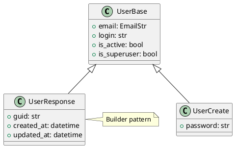

**Код**:
```python
class UserBase(BaseModel):
    email: EmailStr
    login: str
    is_active: bool = True
    is_superuser: bool = False

class UserCreate(UserBase):
    password: str

    @validator("password")
    def password_validation(cls, v):
        if len(v) < 8:
            raise ValueError("Password must be at least 8 characters long")
        return v

class UserResponse(UserBase):
    guid: str
    created_at: datetime
    updated_at: datetime
```

### Структурные шаблоны

#### 1. Facade (Фасад)
**Назначение**: Предоставляет унифицированный интерфейс к набору интерфейсов в подсистеме.

**Реализация**: Класс AuthService в services/auth.py предоставляет упрощенный интерфейс для работы с аутентификацией.

**UML-диаграмма**:
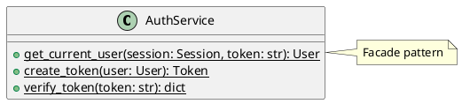

**Код**:
```python
class AuthService:
    @staticmethod
    async def get_current_user(session: SessionDep, token: str = Depends(oauth2_scheme)):
        """Verify token and return current user"""
        # ... implementation details ...
        return user

    @staticmethod
    def create_token(user: User) -> Token:
        """Create JWT token for user with auto-refresh capabilities"""
        # ... implementation details ...
        return Token(...)

    @staticmethod
    def verify_token(token: str) -> Dict[str, Any]:
        """Verify a token and return its payload"""
        # ... implementation details ...
        return payload
```

#### 2. Proxy (Заместитель)
**Назначение**: Предоставляет суррогатный объект, контролирующий доступ к другому объекту.

**Реализация**: Middleware CORS в app.py действует как прокси для всех входящих HTTP-запросов.

**UML-диаграмма**:
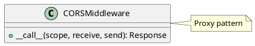

**Код**:
```python
app.add_middleware(
    CORSMiddleware,
    allow_origins=["*"],
    allow_credentials=True,
    allow_methods=["*"],
    allow_headers=["*"],
)
```

#### 3. Adapter (Адаптер)
**Назначение**: Преобразует интерфейс класса в другой интерфейс, ожидаемый клиентами.

**Реализация**: Pydantic модели в models/user.py действуют как адаптеры между SQLAlchemy моделями и API.

**UML-диаграмма**:
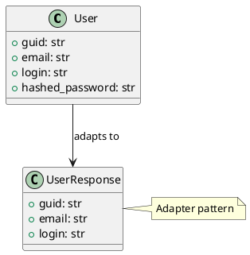

**Код**:
```python
class User(Base):
    __tablename__ = "users"
    guid = Column(String(36), primary_key=True)
    email = Column(String, unique=True)
    login = Column(String, unique=True)
    hashed_password = Column(String)

class UserResponse(BaseModel):
    guid: str
    email: EmailStr
    login: str
    
    class Config:
        from_attributes = True
```

#### 4. Composite (Компоновщик)
**Назначение**: Позволяет клиентам обращаться к отдельным объектам и к группам объектов одинаково.

**Реализация**: Роутеры FastAPI в app.py, где отдельные эндпоинты и группы эндпоинтов обрабатываются единообразно.

**UML-диаграмма**:
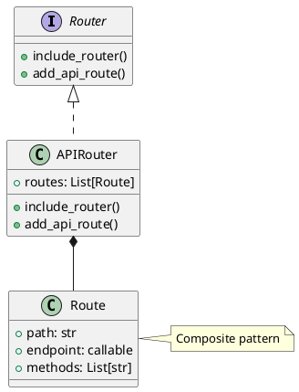

**Код**:
```python
app = FastAPI()

# Chain of Responsibility Pattern
app.include_router(completions_router, prefix="/api/v1")
app.include_router(chat_completions_router, prefix="/api/v1")
app.include_router(healthcheck_router)
app.include_router(user_router, prefix="/user")
app.include_router(auth_router)
```

### Поведенческие шаблоны

#### 1. Chain of Responsibility (Цепочка обязанностей)
**Назначение**: Позволяет передавать запросы последовательно по цепочке обработчиков.

**Реализация**: Роутеры FastAPI в app.py, где запросы проходят через цепочку middleware и обработчиков.

**UML-диаграмма**:
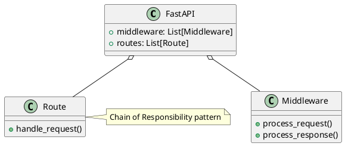

**Код**:
```python
@app.middleware("http")
async def request_logger_middleware(request: Request, call_next):
    response = await call_next(request)
    return response

app.include_router(completions_router)
app.include_router(chat_completions_router)
app.include_router(healthcheck_router)
```

#### 2. Observer (Наблюдатель)
**Назначение**: Определяет зависимость "один-ко-многим" между объектами так, что при изменении состояния одного объекта все его зависимые объекты уведомляются и обновляются автоматически.

**Реализация**: События FastAPI и логирование в app.py.

**UML-диаграмма**:
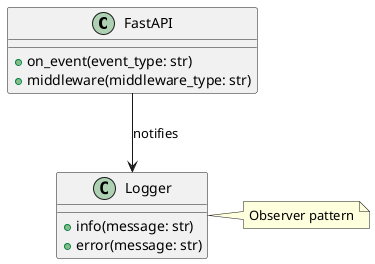

**Код**:
```python
@app.on_event("startup")
async def on_startup():
    logger.info(f"Settings: {settings.__dict__}")
    logger.info("Available endpoints:")
    for route in app.routes:
        logger.info(f"\t{route.path}\tMethods={route.methods}")
```

#### 3. Strategy (Стратегия)
**Назначение**: Определяет семейство алгоритмов, инкапсулирует каждый из них и делает их взаимозаменяемыми.

**Реализация**: Различные стратегии обработки запросов в api/completions.py и api/chat_completions.py.

**UML-диаграмма**:
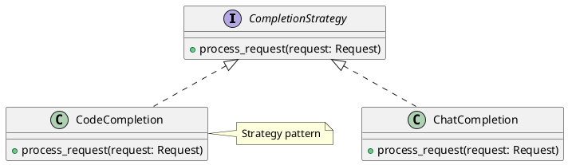

**Код**:
```python
@router.post("/completions")
async def create_completion(request: Request, request_data: dict = Body(...)):
    if "stream" in request_data and request_data["stream"]:
        return await stream_response(url, request_data)
    else:
        async with httpx.AsyncClient() as client:
            response = await client.post(url, json=request_data)
            return response.json()
```

#### 4. Template Method (Шаблонный метод)
**Назначение**: Определяет скелет алгоритма в методе, оставляя определение некоторых шагов подклассам.

**Реализация**: Базовый класс Base в models/base.py определяет общую структуру для всех моделей.

**UML-диаграмма**:
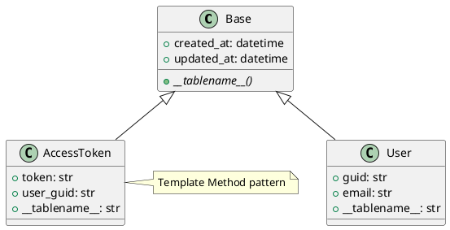

**Код**:
```python
class Base(DeclarativeBase):
    @declared_attr
    def __tablename__(cls) -> str:
        return cls.__name__.lower()

    created_at = Column(DateTime, default=datetime.utcnow)
    updated_at = Column(DateTime, default=datetime.utcnow, onupdate=datetime.utcnow)
```

#### 5. State (Состояние)
**Назначение**: Позволяет объекту изменять свое поведение в зависимости от внутреннего состояния.

**Реализация**: Управление состоянием токенов доступа в models/access_token.py.

**UML-диаграмма**:
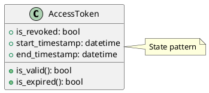

**Код**:
```python
class AccessToken(Base):
    __tablename__ = "access_tokens"
    
    token = Column(String, unique=True, index=True)
    is_revoked = Column(Boolean, default=False)
    start_timestamp = Column(DateTime, nullable=False)
    end_timestamp = Column(DateTime, nullable=False)
    
    def is_valid(self) -> bool:
        return not self.is_revoked and datetime.utcnow() < self.end_timestamp
```

## Шаблоны проектирования GRASP

### Роли (обязанности) классов

#### 1. Information Expert (Информационный эксперт)
**Проблема**: Как распределить обязанности между классами для обеспечения инкапсуляции?

**Решение**: Назначить ответственность классу, который имеет всю необходимую информацию для выполнения обязанности.

**Пример**: Класс User отвечает за валидацию пароля, так как содержит хэш пароля.

```python
class User(Base):
    hashed_password = Column(String, nullable=False)

    def validate_password(self, value: str) -> bool:
        return pwd_context.verify(value, self.hashed_password)
```

**Результаты**: 
- Сильная инкапсуляция
- Низкая связанность
- Высокая сплоченность

**Связь с паттернами**: Дополняет паттерн Factory Method в создании токенов.

#### 2. Creator (Создатель)
**Проблема**: Кто должен отвечать за создание объектов?

**Решение**: Класс должен отвечать за создание экземпляров другого класса, если между ними есть тесная связь.

**Пример**: TokenFactory отвечает за создание токенов доступа.

```python
class TokenFactory:
    @staticmethod
    def create_access_token(data: dict):
        # создание токена доступа
        return encoded_jwt, expire

    @staticmethod
    def create_refresh_token(data: dict):
        # создание токена обновления
        return encoded_jwt, refresh_expires
```

**Результаты**:
- Уменьшение связанности
- Централизация логики создания объектов

**Связь с паттернами**: Реализует паттерн Factory Method.

#### 3. Controller (Контроллер)
**Проблема**: Кто должен обрабатывать входящие системные события?

**Решение**: Выделение отдельных классов-контроллеров для обработки запросов.

**Пример**: Роутеры FastAPI для различных эндпоинтов.

```python
@router.post("/token")
async def login_for_access_token(
    session: SessionDep,
    form_data: OAuth2PasswordRequestForm = Depends()
):
    # логика аутентификации
```

**Результаты**:
- Разделение ответственности
- Улучшение тестируемости
- Упрощение поддержки

**Связь с паттернами**: Работает совместно с Chain of Responsibility.

#### 4. Low Coupling (Низкая связанность)
**Проблема**: Как уменьшить зависимость между различными классами?

**Решение**: Использование интерфейсов и абстракций для уменьшения связанности.

**Пример**: Использование Dependency Injection в FastAPI.

```python
async def get_async_session() -> AsyncGenerator[AsyncSession, None]:
    async with async_session_factory() as session:
        try:
            yield session
        finally:
            await session.close()

SessionDep = Annotated[AsyncSession, Depends(get_async_session)]
```

**Результаты**:
- Упрощение тестирования
- Улучшение поддерживаемости
- Возможность замены компонентов

**Связь с паттернами**: Дополняет паттерн Dependency Injection.

#### 5. High Cohesion (Высокая связность)
**Проблема**: Как сохранить объекты сфокусированными, понятными и управляемыми?

**Решение**: Группировка связанных функциональностей в отдельные модули.

**Пример**: Разделение API на отдельные роутеры по функциональности.

```python
# Chain of Responsibility Pattern
app.include_router(completions_router, prefix="/api/v1")
app.include_router(chat_completions_router, prefix="/api/v1")
app.include_router(healthcheck_router)
app.include_router(user_router, prefix="/user")
app.include_router(auth_router)
```

**Результаты**:
- Улучшение поддерживаемости
- Упрощение понимания кода
- Облегчение тестирования

**Связь с паттернами**: Работает вместе с паттерном Composite.

### Принципы разработки

#### 1. Protected Variations (Защита от изменений)
**Проблема**: Как защитить систему от изменений в её компонентах?

**Решение**: Использование абстракций и инкапсуляции для изоляции изменчивых частей.

**Пример**: Использование абстрактного базового класса для моделей.

```python
class Base(DeclarativeBase):
    @declared_attr
    def __tablename__(cls) -> str:
        return cls.__name__.lower()

    created_at = Column(DateTime, default=datetime.utcnow)
    updated_at = Column(DateTime, default=datetime.utcnow, onupdate=datetime.utcnow)
```

**Результаты**:
- Уменьшение влияния изменений
- Упрощение поддержки
- Улучшение расширяемости

**Связь с паттернами**: Дополняет Template Method.

#### 2. Pure Fabrication (Чистая выдумка)
**Проблема**: Как распределить обязанности при отсутствии естественного выбора?

**Решение**: Создание служебных классов для группировки связанной функциональности.

**Пример**: Создание сервиса аутентификации.

```python
class AuthService:
    @staticmethod
    async def get_current_user(session: SessionDep, token: str):
        # логика получения текущего пользователя
        pass

    @staticmethod
    def create_token(user: User) -> Token:
        # логика создания токена
        pass
```

**Результаты**:
- Улучшение организации кода
- Повышение переиспользуемости
- Снижение связанности

**Связь с паттернами**: Реализует паттерн Facade.

#### 3. Indirection (Посредник)
**Проблема**: Как избежать прямой связи между компонентами?

**Решение**: Использование промежуточных объектов для взаимодействия.

**Пример**: Использование middleware для обработки запросов.

```python
@app.middleware("http")
async def request_logger_middleware(request: Request, call_next):
    response = await call_next(request)
    return response
```

**Результаты**:
- Уменьшение связанности
- Улучшение тестируемости
- Повышение гибкости

**Связь с паттернами**: Дополняет паттерн Proxy.

### Свойство программы (цель)

#### Расширяемость
**Проблема**: Как обеспечить простое добавление новой функциональности?

**Решение**: 
- Использование модульной архитектуры
- Применение принципов SOLID
- Использование абстракций и интерфейсов

**Пример**: Расширяемая система роутинга.

```python
class Application:
    def __new__(cls):
        if cls._instance is None:
            cls._instance = super(Application, cls).__new__(cls)
            app = FastAPI()

            # Легко добавить новые роутеры
            app.include_router(completions_router, prefix="/api/v1")
            app.include_router(chat_completions_router, prefix="/api/v1")
            app.include_router(healthcheck_router)
            app.include_router(user_router, prefix="/user")
            app.include_router(auth_router)

            cls._instance.app = app
        return cls._instance
```

**Результаты**:
- Простота добавления новых функций
- Минимальные изменения существующего кода
- Улучшенная масштабируемость

**Связь с паттернами**: 
- Composite для организации роутеров
- Chain of Responsibility для обработки запросов
- Strategy для различных типов обработки запросов
